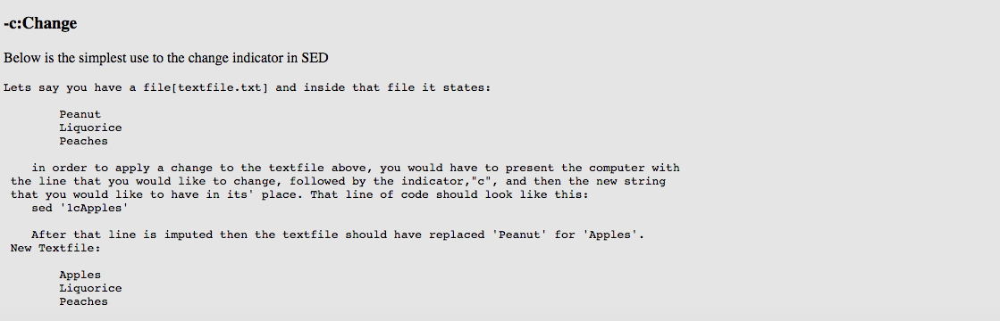

#### Overview and Learning
Throughout this week, I used my google docs list in order to create a basic HTML tutorial with several examples. As the week next week goes by, my goal is to continue adding to the growing list of examples, although I rather have less examples with greater, enriched explanation, than just a list of examples with little to no explanation. Rather than talk about what I have done, I rather display images.  
 
 
